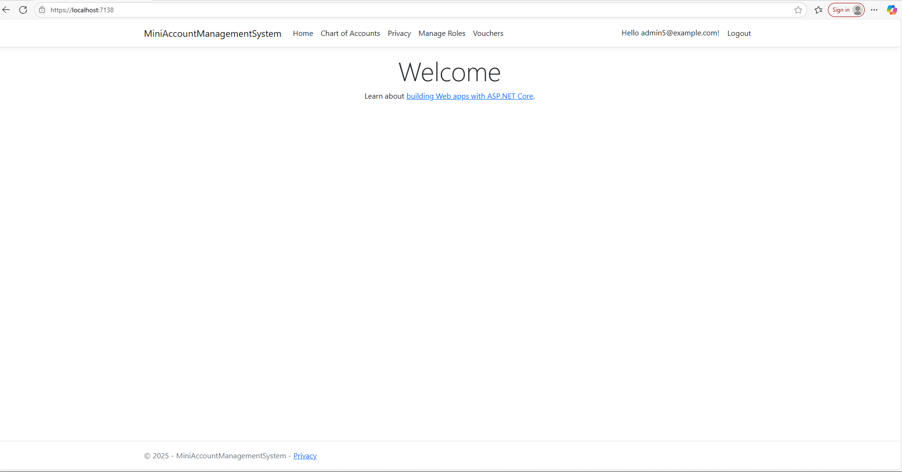
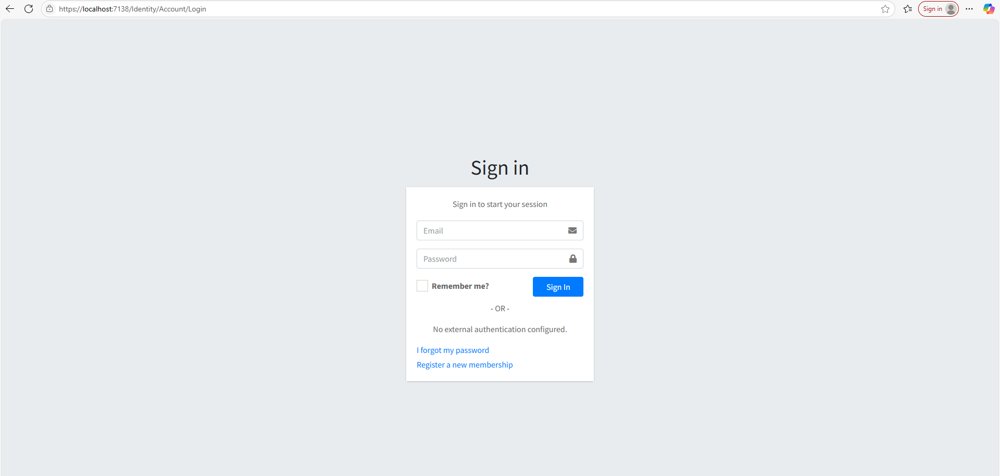
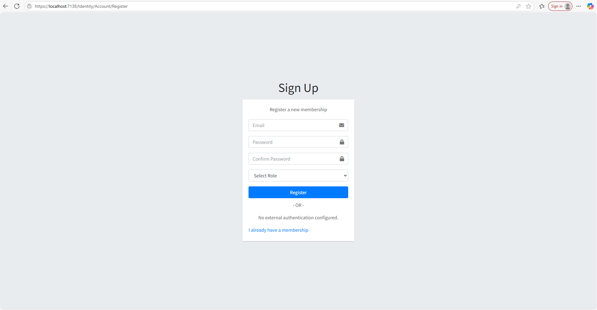
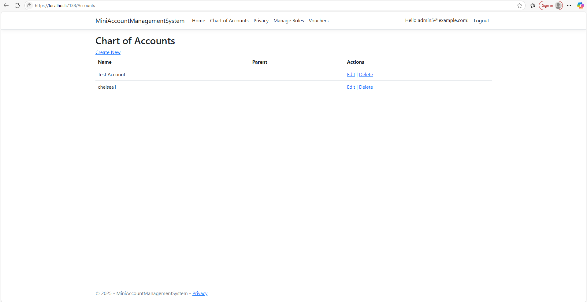
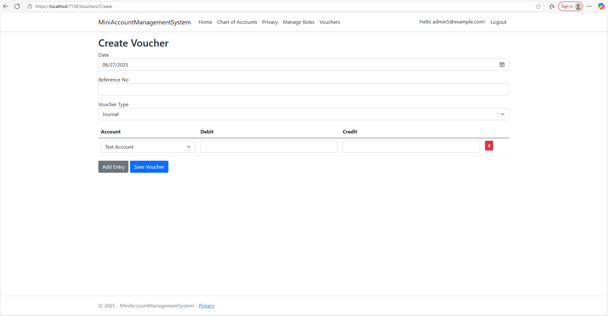
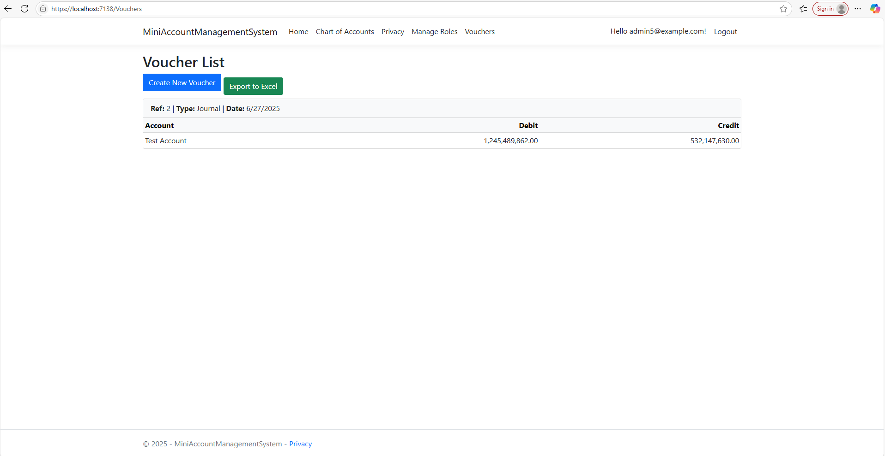
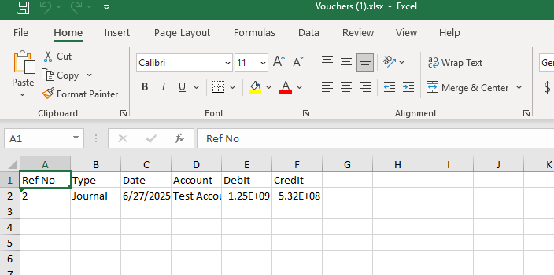

# Mini Account Management System

A small accounting management system built with ASP.NET Core Razor Pages and SQL Server.

## 🧰 Technologies Used
- ASP.NET Core Razor Pages
- ASP.NET Identity (with Roles: Admin, Accountant, Viewer)
- Microsoft SQL Server (Stored Procedures only)
- No LINQ (only ADO.NET)
- ClosedXML (for Excel Export)

## ✅ Core Features
### 1. User Roles & Permissions
- Register/Login/Logout using ASP.NET Identity
- Admin can manage roles (Admin, Accountant, Viewer)

### 2. Chart of Accounts
- Create, edit, delete accounts with parent-child hierarchy
- Stored procedure: `sp_ManageChartOfAccounts`

### 3. Voucher Entry Module
- Create Journal, Payment, and Receipt vouchers
- Multi-line Debit/Credit entry with account selection
- Stored procedure: `sp_SaveVoucher`

### 🔄 Bonus: Export to Excel
- Export voucher list to `.xlsx` file using ClosedXML

## 📷 Screenshots

 
 
 
 
 

